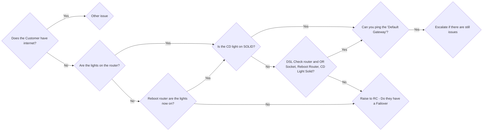
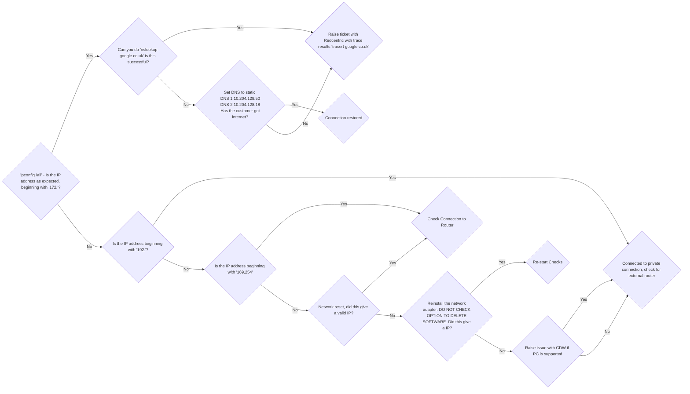

# internet logic

## Router Checks

```mermaid
flowchart LR
    D{Does the Customer have internet?}
    D -- Yes --> E{Other issue}
    D -- No --> F{Are the lights on the router?}
    F -- Yes --> G{Is the CD light on SOLID?}
    F -- No --> H{Reboot router are the lights now on?}
    H -- Yes --> G
    H -- No --> I{Raise to RC - Do they have a Failover}
    G -- Yes --> J{Can you ping the 'Default Gateway'?}
    G -- No --> K{DSL Check router and OR Socket, Reboot Router, CD Light Solid?}
    K -- Yes --> J
    K -- No --> I
    J -- Yes --> L{Escalate if there are still issues}
```

## Extra Checks

```mermaid
flowchart LR
    R{'ipconfig /all' - Is the IP address as expected, beginning with '172.'?}
    R -- Yes --> S{Can you do 'nslookup google.co.uk' is this successful?}
    R -- No --> T{Is the IP address beginning with '192.'?}
    T -- Yes --> U{Connected to private connection, check for external router}
    T -- No --> V{Is the IP address beginning with '169.254'}
    V -- Yes --> N{Reinstall Network Adapter - Escalate}
    V -- No --> W{Network reset, did this give a valid IP?}
    W -- Yes --> N{Check Connection to Router}
    W -- No --> X{Reinstall the network adapter. DO NOT CHECK OPTION TO DELETE SOFTWARE. Did this give a IP?}
    X -- Yes --> L{Re-start Checks}
    X -- No --> Y{Raise issue with CDW if PC is supported}
    Y -- Yes --> U
    Y -- No --> U
    S -- Yes --> Z{Raise ticket with Redcentric with trace results 'tracert google.co.uk'}
    S -- No --> AA{Set DNS to static \n DNS 1 10.204.128.50 \n DNS 2 10.204.128.18 \n Has the customer got internet?}
    AA -- Yes --> Q{Connection restored}
    AA -- No --> Z
```
